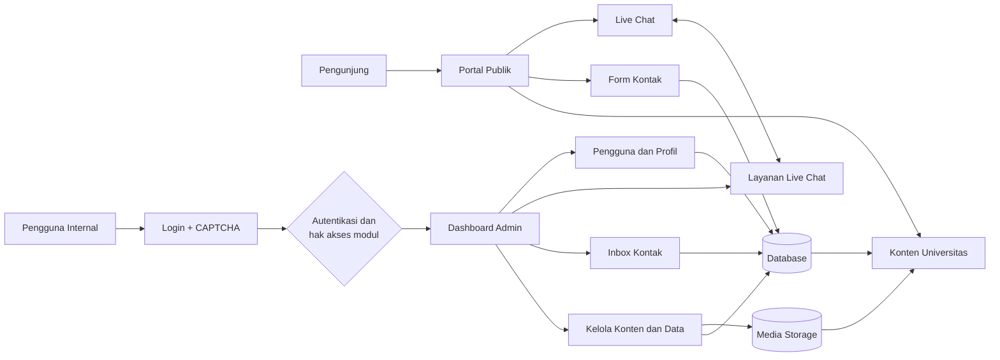

# UFDK Portal

> Portal informasi universitas dan panel administrasi berbasis Laravel.

UFDK Portal menghubungkan kebutuhan informasi publik dengan pengelolaan data internal dalam satu aplikasi: mulai dari profil universitas, program studi, berita, akreditasi, dan kerja sama hingga dashboard admin, hak akses berbasis modul, live chat, dan pencatatan aktivitas.

<p align="center">
  <strong>Portal Publik</strong> · <strong>Panel Admin</strong> · <strong>Manajemen Konten</strong> · <strong>Live Chat</strong>
</p>

## Daftar Isi

- [Tentang Sistem](#tentang-sistem)
- [Fitur](#fitur)
- [Alur Sistem](#alur-sistem)
- [Stack Teknologi](#stack-teknologi)
- [Struktur Proyek](#struktur-proyek)
- [Menjalankan Lokal](#menjalankan-lokal)
- [Perintah Penting](#perintah-penting)
- [Konfigurasi Hosting](#konfigurasi-hosting)
- [Aturan Asset dan Git](#aturan-asset-dan-git)
- [Keamanan](#keamanan)
- [Kontribusi](#kontribusi)

## Tentang Sistem

Sistem memiliki dua area utama:

| Area | Peran |
| --- | --- |
| **Portal publik** | Menyajikan informasi universitas kepada pengunjung. |
| **Panel admin** | Mengelola konten, data akademik, komunikasi, pengguna, dan aktivitas. |

Arsitektur aplikasi mengikuti pola Laravel MVC:

```text
Browser
   │
   ▼
public/index.php
   │
   ▼
Routes → Middleware → Controller
                         │
                         ▼
                   Model / Service
                         │
                         ▼
                   Database / Storage
                         │
                         ▼
                    Blade + Vite
```

## Fitur

### Portal publik

- Beranda dengan hero/banner, statistik, berita, dan mitra kerja sama.
- Profil universitas: sejarah, pendiri, makna logo, visi-misi, sambutan, dan struktur.
- Informasi fakultas dan program studi.
- Berita berdasarkan kategori berita terbaru, prestasi, dan riset.
- Informasi akreditasi dan pusat informasi akademik.
- Informasi biaya kuliah.
- Formulir kontak.
- Live chat dengan status sesi dan antrean pengunjung.
- Dukungan bahasa Indonesia dan Inggris.

### Panel admin

- Dashboard ringkasan data dan aktivitas.
- CRUD banner, berita, mahasiswa, dosen, civitas, guru besar, fakultas, program studi, beasiswa, akreditasi, panduan akademik, pimpinan, dan kerja sama.
- Pengelolaan pesan kontak dan live chat.
- Pengelolaan pengguna dan profil sesuai hak akses.
- Impor/ekspor data tertentu.
- Pencatatan aktivitas login dan aktivitas administrasi.
- Pemeriksaan integritas sumber kode melalui service dan Artisan command.

### Role pengguna

Role yang tersedia:

`super_admin` · `admin` · `media` · `crm` · `kemahasiswaan`

Hak akses diterapkan pada level modul dan operasi:

- `read` — melihat daftar atau detail data.
- `write` — membuat, mengubah, menghapus, atau mengubah status data.

Definisi kewenangan berada di [`App\Models\User`](./app/Models/User.php).

## Alur Sistem

### Gambaran umum



Setiap request masuk melalui `public/index.php`, diteruskan ke route dan middleware, lalu diproses controller. Controller menggunakan model Eloquent atau service untuk membaca dan menulis data. Hasil akhirnya dikembalikan sebagai halaman Blade, file, redirect, atau respons JSON.

### 1. Akses portal publik

1. Pengunjung membuka halaman portal tanpa perlu login.
2. Middleware locale memilih bahasa Indonesia atau Inggris berdasarkan session.
3. Route mengarahkan request ke controller halaman yang sesuai.
4. Controller mengambil konten dari database dan, bila diperlukan, file dari media storage.
5. Blade merender halaman dengan asset yang dibangun oleh Vite.
6. Pengunjung dapat membaca berita, profil universitas, fakultas, program studi, akreditasi, panduan akademik, dan informasi lainnya.

### 2. Autentikasi dan otorisasi admin

```text
Form login
   │
   ├── Validasi email, password, dan CAPTCHA
   ├── Throttling percobaan login
   └── Verifikasi kredensial
            │
            ├── Gagal   → catat aktivitas, buat CAPTCHA baru
            └── Berhasil → regenerasi session, buka dashboard
                                      │
                                      └── periksa role + akses read/write tiap modul
```

Semua route admin dilindungi middleware autentikasi, role, pencegahan cache halaman, dan pencatatan aktivitas. Setelah pengguna lolos autentikasi, `module_access` memeriksa izin `read` atau `write` berdasarkan role sebelum controller menjalankan aksi. Logout mengakhiri session, memperbarui CSRF token, dan mencatat aktivitas logout.

### 3. Pengelolaan dan publikasi konten

1. Admin membuka modul yang diizinkan untuk role-nya.
2. Izin `read` diperlukan untuk melihat data; izin `write` diperlukan untuk membuat, mengubah, menghapus, mengimpor, atau mengubah status data.
3. Request divalidasi oleh controller.
4. Data disimpan ke database, sedangkan gambar atau dokumen disimpan ke media storage sesuai modul.
5. Aktivitas administratif dicatat oleh middleware.
6. Controller publik membaca data terbaru dan menampilkannya kepada pengunjung.

```text
Admin → autentikasi → pemeriksaan modul → validasi
                                           │
                                           ├── Database
                                           └── Media storage
                                                     │
                                                     ▼
                                              Portal publik
```

### 4. Form kontak

1. Pengunjung membuka halaman kontak; sistem juga menghitung status operasional kampus melalui `HolidayService`.
2. Pengunjung mengirim nama, email, subjek, dan pesan.
3. Setelah validasi dan throttling, pesan disimpan dengan status `new` dan kondisi belum dibaca.
4. Admin yang memiliki akses modul chat menerima pesan di inbox.
5. Saat dibuka, pesan berubah menjadi `read`.
6. Admin dapat memperbarui status menjadi `responded` atau `closed`; pesan yang selesai dipindahkan ke riwayat.

### 5. Live chat dan antrean

```text
Pengunjung memulai chat
          │
          ▼
Apakah ada sesi aktif?
   │                  │
  Tidak                  Ya
   │                  │
status: active      status: waiting
started_at diisi    queue_position diisi
   │                  │
   └─────── pesan pengunjung/admin ◄──────┘
                      │
                      ▼
             Admin mengakhiri sesi
                      │
                      ▼
        Sesi waiting paling awal menjadi active
                      │
                      ▼
              Nomor antrean disusun ulang
```

Session browser menyimpan ID chat pengunjung agar halaman dapat mengambil pesan dan status terbaru. Pesan baru menambah penghitung unread untuk pihak penerima. Ketika admin mengakhiri sesi aktif, proses dijalankan dalam transaksi database: sesi ditandai `ended`, pesan sistem dibuat, lalu pengunjung pertama dalam antrean otomatis dipanggil.

### 6. Permintaan reset password

1. Pengguna mengirim email dari halaman lupa password.
2. Sistem memvalidasi email dan mencatat percobaan ke aktivitas login.
3. Jika akun ditemukan dan belum memiliki permintaan aktif, sistem membuat request berstatus `pending`.
4. Pengguna dengan akses pengelolaan user dapat memproses atau menutup permintaan.
5. Jika diproses, sistem membuat password sementara, memperbarui akun, menandai request sebagai `completed`, dan mengirim password baru melalui email.
6. Pengguna login dengan password baru lalu menggantinya melalui pengaturan profil.

## Stack Teknologi

| Lapisan | Teknologi |
| --- | --- |
| Backend | PHP 8.2+ |
| Framework | Laravel 12 |
| ORM | Laravel Eloquent |
| View | Blade |
| Frontend build | Vite 7 + Laravel Vite Plugin |
| CSS | Tailwind CSS 4 + stylesheet proyek |
| JavaScript | ES Modules + Axios |
| Database | SQLite default; mendukung MySQL, MariaDB, PostgreSQL, dan SQL Server |
| Testing | PHPUnit 11 melalui Laravel Test Runner |
| Utility | Yasumi, Laravel Tinker, Laravel Pint |

## Struktur Proyek

```text
app/
├── Http/Controllers/       Controller publik dan admin
├── Http/Middleware/        Auth, locale, role, throttle, dan logging
├── Models/                 Model Eloquent
├── Services/               Service kalender dan audit
└── Support/                Helper aplikasi

bootstrap/                  Bootstrap Laravel
config/                     Konfigurasi aplikasi
database/
├── factories/              Factory data
├── migrations/             Perubahan skema database
└── seeders/                Seeder data pengembangan

public/                     Document root hosting
├── build/                  Manifest dan asset hasil Vite
├── css/, js/               Asset publik tambahan
├── images/                 Foto/media runtime
├── files/                  File publik yang diunggah
├── vendors/                Asset pihak ketiga
├── .htaccess
└── index.php               Front controller Laravel

resources/
├── views/                  Template Blade publik dan admin
├── css/                    Source stylesheet
└── js/                     Source JavaScript

routes/                     Route web dan console
storage/                    Log, cache, dan storage aplikasi
tests/                      Pengujian
```

## Menjalankan Lokal

### Prasyarat

- PHP 8.2 atau lebih baru
- Composer
- Node.js dan npm
- Ekstensi PHP yang dibutuhkan oleh Laravel dan driver database

### Instalasi

Jalankan dari root proyek:

```bash
composer install
npm install
```

Buat `.env` lokal dari template yang tersedia, kemudian isi konfigurasi lokal secara aman. Jangan menggunakan kredensial produksi.

```bash
php artisan key:generate
php artisan migrate
npm run build
```

### Mode pengembangan

Untuk menjalankan server aplikasi dan Vite secara terpisah:

```bash
php artisan serve
npm run dev
```

Atau gunakan seluruh proses pengembangan melalui Composer:

```bash
composer run dev
```

## Perintah Penting

| Kebutuhan | Perintah |
| --- | --- |
| Melihat route | `php artisan route:list` |
| Menjalankan migration | `php artisan migrate` |
| Menjalankan test | `php artisan test` |
| Menjalankan test via Composer | `composer run test` |
| Build asset production | `npm run build` |
| Mode Vite development | `npm run dev` |
| Format kode PHP | `vendor/bin/pint` |
| Membuat symbolic link storage | `php artisan storage:link` |

## Konfigurasi Hosting

Struktur proyek telah mengikuti pola Laravel standar:

```text
DocumentRoot → project/public
```

**Jangan** mengarahkan document root ke root repository karena folder seperti `app`, `config`, `database`, `resources`, `routes`, dan `vendor` tidak boleh terekspos langsung.

Checklist deployment:

1. Arahkan document root web server ke `public/`.
2. Pastikan `public/index.php` dapat memuat `../vendor/autoload.php`.
3. Pastikan rewrite Apache aktif agar request non-file diteruskan ke `index.php`.
4. Jalankan `npm run build` sebelum rilis asset frontend.
5. Siapkan environment production melalui secret manager atau konfigurasi server.
6. Jalankan migration secara terkontrol setelah backup database.
7. Pastikan permission `storage/` dan `bootstrap/cache/` sesuai kebutuhan Laravel.
8. Verifikasi halaman publik, login admin, hak akses, upload media, kontak, dan live chat.
